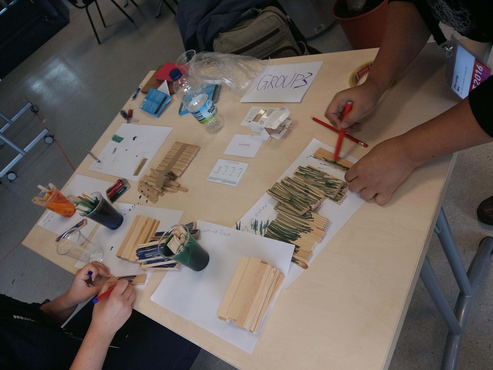

# Data Physicalization workshop at the DRS conference, 29 June 2016, Brighton, UK

! DISCLAIMER:  This is a report of an activity during the workshop and not a research report. 
We are speaking from our subjective points of view as workshop organizers.

## Let’s Get Physical, Exploring the Design Process of Data Physicalization
Yvonne Jansen, Pauline Gourlet, Uta Hinrichs, Trevor Hogan and myself have organized a workshop on data physicalization at the Design Research Society conference 2016 at Brighton UK. And people really got physical! 

We have previously run data physicalization workshops in different settings and contexts. Yvonne and Trevor had conducted such workshop mostly in computer oriented academic conferences (ACM TEI, ACM CHI, IEEE VIS) and Samuel Huron experienced more informal settings like Science Fair (Futur en Seine in Paris) or community associations and academic contexts. At DRS, we were expecting to meet design practitioners and design researchers, whose backgrounds and expertise differ from what we had experienced in the past. Therefore, we wanted to redesign a specific workshop for these attendees. 
Overall, we all agree on the fruitfulness and richness of this session that built on our previous successes and failures, and proposed a more structured activity. We experienced interesting processes and surprises !  

Our initial goals were: 

 * to provide our participant with a fruitful and enjoyable experience, 
 * to design a new type of physicalisation workshop tailored for designers,
 * to observe participants' productions and processes during the activity and their engagement with the different materials. 

Below, we will briefly present the workshop procedure, setup, and materials. Later, we are reporting on the fabulous part: what participants have created and what we enjoyed the most.

## Workshop presentation 

As an introduction, the 5 of us shortly presented our work and described the workshop, the activities and the objectives.
We also did a round robin for the participants to introduce themselves. 
<iframe src="https://docs.google.com/presentation/d/1YQSuMf44jIPykxqUCOv8mfi-p5lMy7Q-uxf2I473i8U/embed?start=true&loop=true&delayms=3000" frameborder="0" width="100%" height="299" allowfullscreen="true" mozallowfullscreen="true" webkitallowfullscreen="true"></iframe>

## Do.Doc Demo 

After presenting the full activity, Pauline Gourlet gave us a quick demo how to use [Do.Doc](www.latelier-des-chercheurs.fr). Do.Doc is a system to document design and learning activities. We asked our participants to use it in order to produce two types of document: a documentation of their creation processes and a communication summary that would explain and present their physicalisation to people who did not participate to the process.

## The Workshop Process
The aim of this sessions was to get everyone to produce at least one data-physicalization. As we did not want participants to get lost in this process (which can be tricky!), we structured it with heavy constraints, playing on both the design task and the materials.

To set the constraints on the design task, we designed 3 different types of cards:
 * Six dataset cards - Each one dispalys a filtered dataset with a legend and some metadata. 
 * Six situation cards - Each one shows a drawing (made by Samuel) with a label that indicate a particular context.
 * Six task cards - We picked six high-level tasks described using one word displayed on each card. 

We also chose a set of materials (about 15 in total).

We structured the process as follow:

### Grouping and Picking

People had to team up in groups of two to three people. Then, they would pick three cards: one of each type (task, situation, dataset).
 

### Reading the data

Participants were invited to spread in the space and to choose a table where to work. All the groups had five to ten minutes to read the cards. They reflected on these 3 cards, their content and discussed first insights and ideas (what and how to physicalize it as a group). Note, at that time, most participants did not yet choose their materials.

Below the distribution of cards by groups: 

| Group |  Dataset  | Situation  | Task 	   |
|-------|----------|------------|----------|
| 1 | Distribution of consumed alcohols | Museum  | Enjoy |
| 2| Asylum applicants to e.u. countries (2011-2015) | Classroom  | Collaborate |
| 3 | Why people come to fablabs? | Research seminar  | Discover | 
| 4 | Tarantino movies (profits, death, Swear words)  | Home  | Communicate | 
| 5 | Mean appropriatness rating | Business Meeting  | Collect | 

### Selecting materials

To build physicalization, it is important to have some materials !
So we bought and bring a lot of different materials: craft paper, different shapes of pasta, pearl clay, clay, kapla, plastic token square and rounds, Lego bricks, colour, pipe cleaners, wood sticks, wool, food colouring products, plastic glass, water bottle, stickers, and others. The constraint here was for each team to **select a maximum of 3 different materials** to build the physicalization.

We also provide tools, such as the cutter, cut mats, pen, sticky notes, rulers.
This was accessible to all team, but **have to be shared with other teams**. 

### Building and documenting 

Participants of each team start to plan what and how to represent. Some were cutting papers, other colouring kapla, other drawings, documenting with the dodoc station. Some were writing, planning, assembling materials together, or hanging materials to the ceiling. This moment was pretty fun. As facilitators, we tried to help people as we could but all groups were independent and focused on their physical construction. At the end of the process, some groups simulated and tested the principles of their physicalizations. After this intense activity, we had a well-deserved lunch break. 

## Presenting to others 

After lunch, participants had a limited amount of time to produce a documentation of their physical representation to present it the other groups. Each group was invited to create something for others to understand their phisical representations without explaining it with words. Some participants decided to create small videos or a blog post on dodoc, some did a performance, some others a live explanation. Below I present a snapshot of each one.  

### Groupe 1: Token on map 

| Group |  Dataset  | Situation  | Task 	   |
|-------|----------|------------|----------|
| 1 | Distribution of consumed alcohols | Museum  | Enjoy |

Group 1 drew and coloured a world map. On top of it, they assembled tokens of different colours that represented types of alcohols (beers, wine, spirit and others). Piles of tokens were positioned on the map according the alcohol consumption in each country. They also produce this nice little animation below and documentation on Do.Doc. 

### Groupe 2: Asylum garland

| Group |  Dataset  | Situation  | Task 	   |
|-------|----------|------------|----------|
| 2| Asylum applicants to e.u. countries (2011-2015) | Classroom  | Collaborate |

Group 2 decided to present their physicalization through a performance. 
Kate and Diane first distributed to each participant a craft garland creating a human chain shape. Some garlands were representing human females and some others, males. When they gave the garlands to the participants they said: "Take this, you are responsible for it". The garlands displayed a colour point and had different sizes. 

The moment was intriguing: every one of us received a piece of paper and did not know yet what it meant. When all the garland were distributed, they started to explain: 
"Each human shape on the garlands represents 1000 humans. Garlands with skirts are female, with pants are male. These humans are asylum applicants to E.U. countries." 
Then, they explain the signification of the colour dots. "What is your colour dots? If it is green it means your asylum applicants are under 14-year-olds, if it is blue they are under 17-year-olds." 
This moment was intense, it changed the way we were holding our garlands, considering them from a different perspective. 

Then because we all had one garland, we could compare them, sort them, ask everyone what garland they had, how many people it represented, their age. 
Several strips of craft paper were also structuring different space on the table. These were acting as boundaries, as walls to cross that differentiate between inside the EU and outside the EU. Now, holding these garlands, we collectively made some choices and positioned them in the space.

### Groupe 3: Colored Kapla 

| Group |  Dataset  | Situation  | Task 	   |
|-------|----------|------------|----------|
| 3 | Why people come to fablabs? | Research seminar  | Discover | 

Group 3 colored wiht different colors wood elements, according to people’s motivations to go to a fablab. The elements were displayed as a heap on the table. As we gathered around the table, we were thrived to discover what these wood elements represented, and we spontaneously began to sort them out: we sorted them according to colors and sizes. At some point, we were guided by the group who produced it to bridge our stacks with the appropriate paper labels. 

### Groupe 4: The pignata visualization

| Group |  Dataset  | Situation  | Task 	   |
|-------|----------|------------|----------|
| 4 | Tarantino movies (profits, death, Swear words)  | Home  | Communicate | 

Group 4 created some little boxes in folded paper, arranged on strings coming out of the ceiling and filled with little colored  woodpieces. Each box represented a Tarantino movie. The little woodpieces inside them symbolized swear words told in each movie. Some other elements (red strings, sweets) were showing profits and the number of deaths. 

### Groupe 5: Elastic appropriatness

| Group |  Dataset  | Situation  | Task 	   |
|-------|----------|------------|----------|
| 5 | Mean appropriatness rating | Business Meeting  | Collect | 

The last group picked a pretty challenging high-level task: "collect". They designed a really sensible physicalization tool to collect feedback on appropriateness questions during a job interview. The interviewee sits at one side at the device and the interviewer at the other side. They have to pull an elastic of a certain color to declare the level of appropriateness of a certain behaviour. The more they pull, the less it is appropriate to them. The position of the elastic on the grid created by the wood stick plots visually the level of appropriateness. But be aware if one pulls the elastic too hard it breaks the device !!! :) They presented their device using a narrative created with Do.Doc (see gif).

## Concluding 

We envisioned that we would be able to iterate on these first design pieces, but we were running out of time and felt pretty loaded with tones of new information already. 
We concluded the workshop with a collective discussion, where we all expressed our general impression about the different phases of the workshop. It has been noted as a general feedback that constraints were useful and helped participants to engage with the process. The "silent presentations" were also appreciated and the comments others made while trying to interpret the products were perceived as useful and important.
Among other topics, we discussed : 
- what participants and organizers thought of the workshop
- what was enjoyable
- what challenges participants faced when engaging with the process of data-physicalization
- the role of embodiement (practicing data-physicalization?)
- what makes the physical aspect of these representations interesting ?
- the important role of the presentation of the product
- what place for the documentation process ? for what purpose ?
- if they would like to adapt this type of activity and how ? 

When we cleaned the room, we could not throw away the garlands, so some participant hang up on the wall of the room. I hope people from the Brighton School of Art will take care of them. 

Thank you to all our participants, we had a really great time and learnt a lot.

LIST OF PARTICIPANTS
- Kate McLean
- Fiona McLellan
- Kathryn Shroyer
- Diane Simpson-Little
- Pei-Ying Wu
- Marie-Julie Catoir-Brisson
- Judith Aranson
- Juliana Forero
- Michele Mauri
- Jari-Pekka Kola
- Chesca Kirkland

You can download the card set here: 
You can contact us here: 
You can leave a comment here: 

