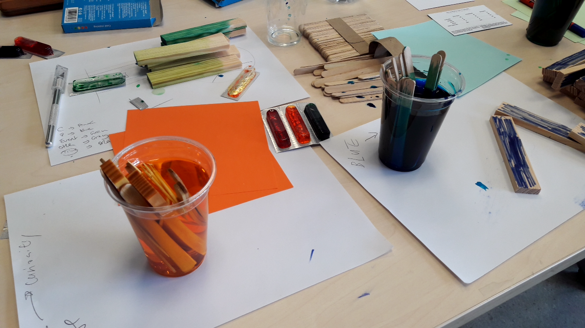

# Physicalisation workshop at the DRS conference, 29 June 2016, Brighton, UK

! DISCLAIMER:  This is a report of an activity during the workshop and not a research report. 
We are speaking from our subjective point of view of workshop organizers and not as a scientific researcher.

Yvonne Jansen, Pauline Gourlet, Uta Hinrichs, Trevor Hogan and myself have organized a workshop on data physicalisation at the Design Research Society conference 2016 at Brighton UK. The workshop was title "Let’s Get Physical, Exploring the Design Process of Data Physicalization". And people really get physical. 

We have previously run data physicalisation workshops in different settings and context. For Yvonne and Trevor it was mostly during computer oriented academic conferences (ACM TEI, ACM CHI, IEEE VIS) and for myself in informal settings like Science Fair (Futur en seine) or community associations and also academic ones. Public from these contexts are pretty different from the DRS attendees. At DRS we were expecting to meet a practitioner in design, designers and design researchers. So we wanted to redesign a specific workshop for these attendees. We haven't been disappointed and get some interesting surprised !  

Our initial goals was: 

 * to provide to our participant a fruitful and enjoyable experience, 
 * to design a new type of physicalisation workshop focus on designers,
 * to observe what participant produce during the physicalisation activity with different materials. 

Below I will briefly present the workshop procedure, setup, and materials. Later I am reporting on the fabulous part: what participants have created and what I enjoyed the most.

## Workshop presentation 

During the introduction we shortly present the activity and ourselves.
We also did a round robin where each of the participant present themselves. 
<iframe src="https://docs.google.com/presentation/d/1YQSuMf44jIPykxqUCOv8mfi-p5lMy7Q-uxf2I473i8U/embed?start=true&loop=true&delayms=3000" frameborder="0" width="100%" height="299" allowfullscreen="true" mozallowfullscreen="true" webkitallowfullscreen="true"></iframe>

## Dodoc Demo 

After presenting the full activity, Pauline Gourlet give us a quick demo how to use [dodoc](). Dodoc is a system to document design and learning activities and we ask our participant to use it in order to produce two documents. A documentation of their creation process and a document that explain and present their physicalisation to people who did not participate into the creation process.

## Grouping and Picking

We design a three set of six cards of different colours:

 * Six dataset cards - Each of them contains a filtered dataset with a legend and some metadata. 
 * Six situation cards - Each of them contains a drawing I made and a word of a particular context
 * Six task cards - Each of them contain a word that evokes a specific task. 

## Reading the data

Participants were invited to choose a table. All the groups had five to ten minutes to read the cards. Reading the dataset, the task and the situation card. This moment was focus on reflecting on these three cards, their content and discuss what and how to physicalize it as a group. At that time most participants did not yet choose their materials.

Below the distribution of cards by groups: 

| Group |  Dataset  | Situation  | Task 	   |
|-------|----------|------------|----------|
| 1 | Distribution of consumed alcohols | Museum  | Enjoy |
| 2| Asylum applicants to e.u. countries (2011-2015) | Classroom  | Collaborate |
| 3 | Why people come to fablabs? | Research seminar  | Discover | 
| 4 | Tarantino movies (profits, death, Swear words)  | Home  | Communicate | 
| 5 | Mean appropriatness rating | Business Meeting  | Collect | 

## Selecting materials

To build physicalisation, it is important to have some materials !
So we bought and bring a lot of different materials: craft paper, different shapes of pasta, pearl clay, clay, kapla, plastic token square and rounds, Lego bricks, colour, pipe cleaners, wood sticks, wool, food colouring products, plastic glass, water bottle, stickers, and others. We give one constraint to our participant to **select maximum 3 different materials** to build the physicalisation.

We also provide tools, such as the cutter, cut mats, pen, sticky notes, rulers.
This was accessible to all team, but **have to be shared with other teams**. 

## Building and documenting 

Participants of each team start to plan what and how to represent.  Some was cutting papers, other colouring kapla, other drawings, documenting with the dodoc station. Some was writing, planning, assembling materials together, or hanging materials to the ceiling. This moment was pretty fun. As facilitator we try to help people as we can but all group was independent and focus on their physical construction. At the end of the process we saw some group simulating and testing how their physicalisation should work. After this intense activity, we had a lunch break. 

## Presenting to others 

After the lunch break, the participant had a limited amount of time to prepare a document to explain their physical representation to other groups. The goal of this document it to allow people to understand the visual representation.  Some participant decides to create small video or a blog post on dodoc, some a performance, some a live explanation. Below I present a snapshot of each one.  

### Groupe 1: Token on map 

| Group |  Dataset  | Situation  | Task 	   |
|-------|----------|------------|----------|
| 1 | Distribution of consumed alcohols | Museum  | Enjoy |

The group 1 draw and coloured a world map, on top of it they assemble tokens of different colours (beers, wine, spirit and others). Piles of tokens were positioned on the map according the alcohol consume in each country. They also produce this nice little animation below and documentation on dodoc. 

### Groupe 2: Asylum garland

| Group |  Dataset  | Situation  | Task 	   |
|-------|----------|------------|----------|
| 2| Asylum applicants to e.u. countries (2011-2015) | Classroom  | Collaborate |

The group 2 decide to present their physicalisation through a performance. 
Kate and Diane first distribute to each of the participant a craft garland cut into human chain shape, some garland was human female and male. When they gave the garland to each participant they said: "Take this, you are responsible for it". The garlands contains a colour point and have different sizes. 

The moment was intriguing, every one of us received a piece of paper and did not know yet what that mean. When all the garland was distributed they start explaining: "each human shape on the garland represents 1000 humans", "garland with skirts are female, with pants are male", these humans are asylum applicants to E.U. countries. Then they explain the signification of the colour dots. "What is your colour dots?" if it is green it means your asylum applicants are under 14-year-olds, if it is blue they are under 17-year-olds. This moment was intense, I change the way I was holding my garland considering it from a different perspective. 

Then because we all have one garland we can compare them, sort them, ask everyone what garland they have, how many, what age. Several strip of craft paper was also structuring different space on the table. This space was symbolizing inside the EU, outside of EU. etc. Now having these garlands we can collectively make some choices and position in space the garland.

### Groupe 3: Coloured Kapla 

| Group |  Dataset  | Situation  | Task 	   |
|-------|----------|------------|----------|
| 3 | Why people come to fablabs? | Research seminar  | Discover | 

The group 3 different coloured wood elements according to people’s motivation to go to a fablab. The element was in a heap on the table. As the task was to discover, the author invites us to organize and arrange the physicalisations. Participants sorted all the elements according to colours and size. 

### Groupe 4: The pignata visualization

| Group |  Dataset  | Situation  | Task 	   |
|-------|----------|------------|----------|
| 4 | Tarantino movies (profits, death, Swear words)  | Home  | Communicate | 

The group 4, created some little boxes in folded paper fill with little plastic square pieces.  Each box represented a Tarantino movie. The little plastic piece inside the Swear words. Some part was presenting the profit and the number of deaths. 

### Groupe 5: Elastic appropriatness

| Group |  Dataset  | Situation  | Task 	   |
|-------|----------|------------|----------|
| 5 | Mean appropriatness rating | Business Meeting  | Collect | 

The last group add a pretty challenging task "collect". They design a really sensible physicalisation tool to collect feedback on the appropriateness question during a job interview. Interviewee is at one side at the device and interviewer at the other side. They have to pull an elastic of a certain colour to declare the level of appropriateness of a certain behaviour. More they pull less it's appropriate. The position of the elastic on the grid made by the wood stick plot visually the level of appropriateness. But be aware if one pulls the elastic too hard it breaks the device !!! :) 

## Concluding 

We conclude the workshop throught a collective discussion about: what participant think of the workshop, what they enjoy, what challenges they face, if they would like to adapt the activity and how ? 

When we clean the room We can not throw the garlands in the garbage so some participant hang up on the wall of the room. I hope people from Brighton School of Art will take care of them. 

You can download the card set here: 
You can contact us here: 
You can leave a comment here: 

